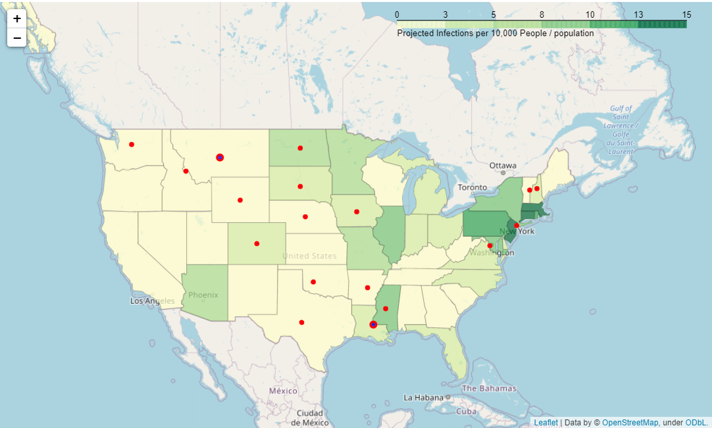
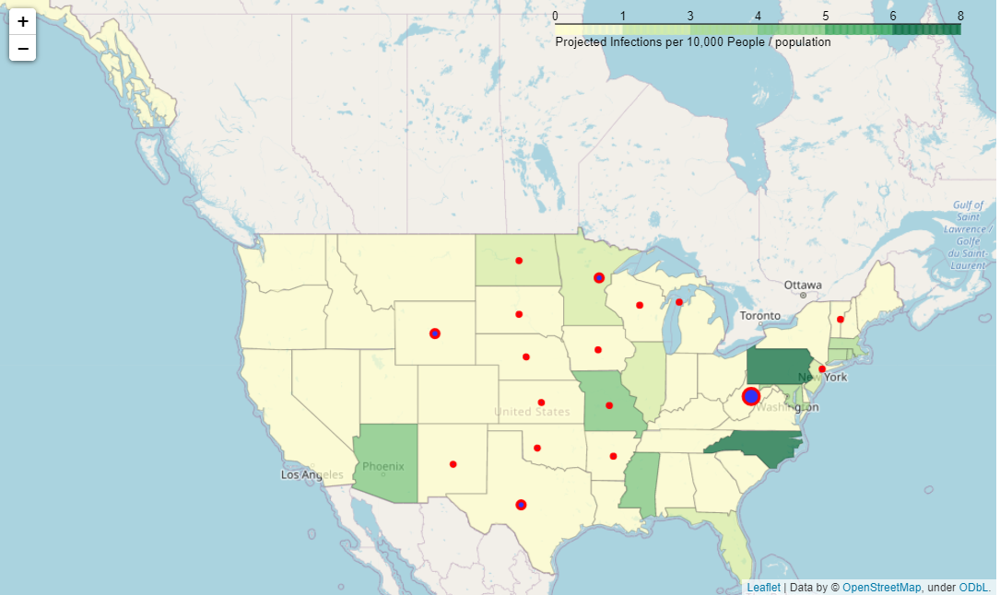
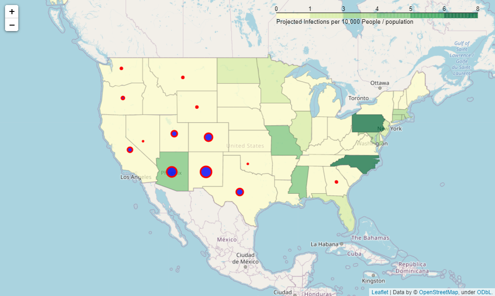
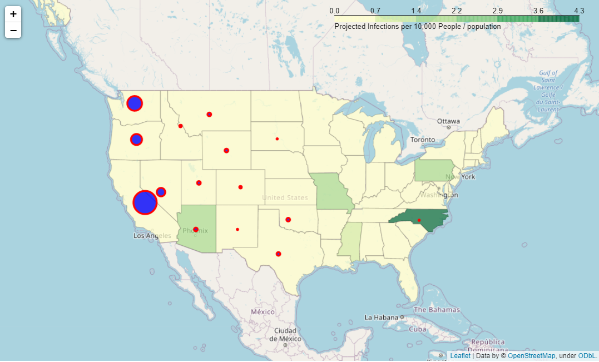
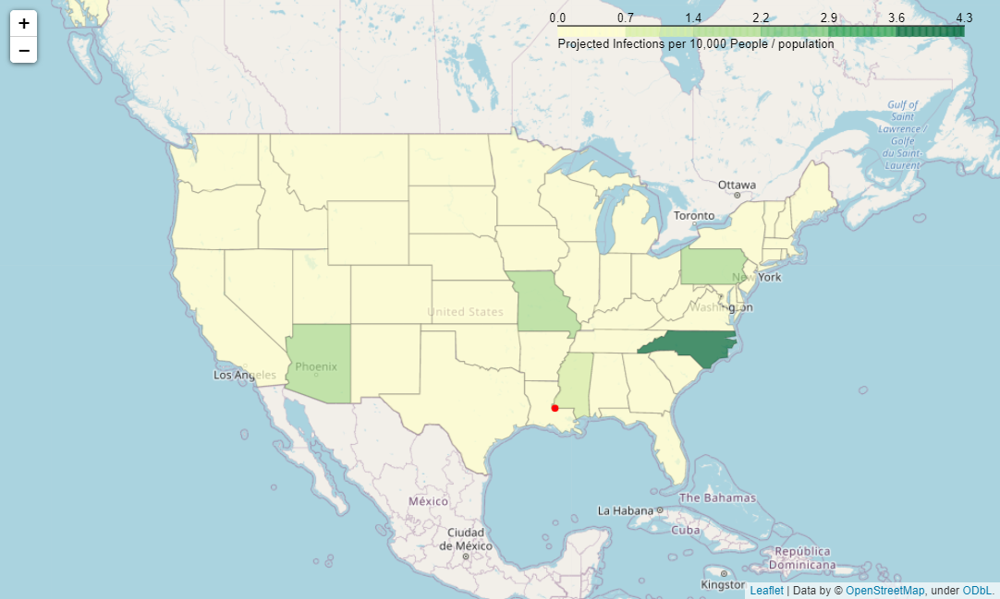
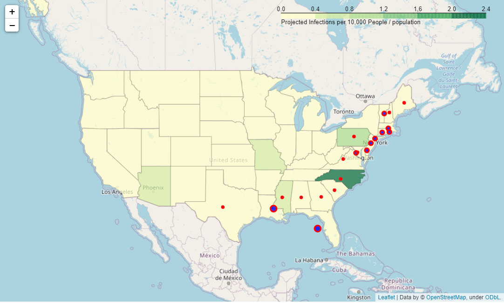

# Coalescence of COVID-19 with Natural Disasters
***Brooks Jessup - Alicia Rodriguez - Griffin Talan***

## Problem Statement
In order to solve a client problem, we are tasked with determining the overlap with between COVID-19 infection rates and the occurence of natural disasters so that the overall impact of both disasters does not combine to create a larger problem. 
The COVID directory of this repository represents one of the three main components of our group project to identify areas at risk for both COVID-19 and other natural disasters. The COVID component of the project aims to identify areas at risk for COVID-19, so that these can be compared and overlaid with areas at risk for other natural disasters.
The Natural Disaster directories aim to explore the frequency of natural disasters in which there is a need for evacuation per US states and California's counties. 
By combining the future predictions of each data source and mapping with GIS, and overlay of at-risk areas was determined.

### Background Information:
COVID-19 is a type of coronovirus that was identified in late 2019. At the time that this project was conducted (mid-May, 2020), the disease had spread from China across most of the world. In the United States, the death toll from COVID-19 is estimated to have exceeded 80 thousand as of May 11th. Starting back in March 2020, most states had imposed stay-at-home orders and other restrictions on mobility in order to slow the spread of the disease. By early May, these policies had successfully brought both the infection and death rates under control in some states, which began a process of “reopening”. We are still in the early days of this new stage of the response to the virus, and the effects of this easing of restrictions on mobility and contact are still unclear.

### Geographic scope:
Our group decided to limit the geographical scope of our project to the United States. The main reason for this decision was that the data reported by other countries is highly inconsistent and unreliable. Most forecasts for the future spread of COVID-19 in the U.S. focus on the state as their main unit of analysis. Our project is therefore also focused on the 50 U.S. states. However, focusing only on the state level alone obscures the fact that each state comprises a diverse range of communities, which have been unevenly affected by COVID-19. We therefore decided to also conduct a more granular case study of the counties within one state. We chose California for the case study both because it is our home state and because it contains a particularly diverse set of county-level communities.

### Temporal scope:
We decided that we wanted to expand the temporal scope of our project through at least the summer months, because this is when many types of natural disasters are most likely to strike communities in various parts of the country (see the Natural Disaster component of the project). Although we were able to find state-level projections for COVID-19 that extend into August, we were unable to find the same range of forecasts at the county level. As a result, the temporal scope of our national analysis runs from mid-May to early August, but the scope of our California case study only runs from mid-May to mid-June.

### Specific questions:
The specific questions answered by the COVID component of our project are as follows: (1) Which states in the U.S. are most likely to experience severe COVID-19 conditions between mid-May and early August? (2) Which counties in California are most likely to experience severe COVID-19 conditions between mid-May and mid-June?

## Data Collection

### COVID

To identify communities at risk for severe COVID conditions in the coming months, we collected projected data from leading research centers in the field of public health. Numerous organizations have created machine learning models to predict the future spread and impact of COVID-19. The models available offered a wide range of divergent projections due not only to their different algorithms, but also to an incomplete medical understanding of the disease and to uncertainties in the underlying reported data. We evaluated and selected projected data based on the criteria of expertise, transparency, and thoughtfulness of the models, as well as the relevancy of the information they provide for answering our specific questions.

***National Data***
For our data on the national scale, we selected the projections generated by the Institute for Health Metrics and Evaluation (IHME) at the University of Washington. The IHME model (after a major revision on May 4th) is a hybrid combination of a non-linear regression fit to the curve of COVID death rates and an SEIR (Susceptible-Exposed-Infectious-Recovered) model to simulate the spread of infectious diseases. It is one of the only respectable models to provide projections over multiple months into August, which allowed us to extend our study through the summer months when certain types of natural disasters are most likely to strike. Our evaluation of the IHME model shows that over the week from May 4th to May 11th, it can only explain 54% of the variance in the reported data and its predictions for the daily national increase in COVID infections have an approximate average error of 2,647 cases. This is a reminder of the uncertainty in these, and any, COVID projections. More information on the IHME model can be found [here](http://www.healthdata.org/sites/default/files/files/Projects/COVID/Estimation_update_050420.pdf).

***California Data***
For our data on the county-level in California, we selected the projections generated by the Mailman School of Public Health (MSPH) at Columbia University. MSPH uses a metapopulation model that simulates the spread and growth of COVID-19 incidence in the US. Although the MSPH model only makes projections through June 20th, it is one of the few available models with a county-level resolution. The MSPH model implements different scenarios based on how quickly states reopen. For California, we selected the scenario in which the state gradually reopens with an increase in contact rates of 5% weekly. More information on the MSPH model can be found [here](https://www.medrxiv.org/content/10.1101/2020.05.04.20090670v2).

### Natural Disasters

The source for natural disaster data collection was FEMA: Federal Emergency Management Agency. This dataset is a declaration of the disasters summary from 1953 - 2020, for this project we took into account the data from 2010 - 2020 and obtain the frequency by dividing the total events by 10. Originally the data showed 26 disasters in the nation, but only 6 were taken into consideration which are the ones were evacuation of the population is needed which in this time of COVID-19 will be a high risk for its spread. The 6 natural disasters are the following:

- Hurricanes
- Floods
- Fires
- Earthquakes
- Tsunamis
- Volcanoes

**Data Dictionary**

| Feature  | Description  |
|---|---|
|State   |The name or phrase describing the U.S. state, district, or territory   |
|Declared County Area  |The name or phrase describing the U.S. county that was included in the declaration   |
|Incident Begin Date  |Date the incident itself began   |
|Incident Type   |Type of incident, the incident type will affect the types of assistance available   |

## Exploratory Data Analysis

### COVID-19

For both the IHME and MSPH projected data, we reduced the shape of the data to our desired geographic scales (i.e. the United States and California, respectively). In the IHME dataset, we also dropped the incomplete data after August 4th. In the IHME dataset, this left us with 4,250 rows of data (85 days for each of the 50 states). In the MSPH dataset, we had 2,436 rows (42 days for each of the 58 counties).
The IHME dataset includes projections for many variables, such as hospital capacity, mobility rates, and cumulative deaths. However, the most important factor determining how a natural disaster would interact with the pandemic is the prevalence of the virus in the local community. We therefore decided to focus only on the estimated number of daily new infections, and to scale this figure in proportion to the size of the local population. Following California’s guidelines for the reopening of counties, we labeled communities (state or county) with one or more new daily infections per 10,000 residents as experiencing severe COVID conditions.

### Natural Disasters

We wil analyze different aspects like states, counties, incident types and months to have a visualization of these features in relation with natural disasters. The top three states and CA counties that have a higher frequency per year of the 6 natural disasters mentioned above are:

***National***

| State  |Frequency per Year (Natural disasters) Nationwide  |
|---|---|
|California | 8.6  |
|Texas   |5.1   |
|Washington   |4.4   |

***California***

|County  |Frequency per Year (Natural disasters) CA  |
|---|---|
|Los Angeles | 2  |
|Kern   |1.3   |
|Riverside   |1.2   |

Also is very important to highlight which are the highest risky months for these natural disasters to occur along the year.
We can observe that nationwide is making reference for the upcoming months of the year that we should take into consideration. One way that FEMA supports these disasters is through mission assignments which are resources for emergency management needs; this information can support FEMA as a reference on where and when to allocate their resources.

***National***

|Month   |Natural Disasters Frequency Nationwide (yearly)  |
|---|---|
|August   |13  |
|June   |8.8   |
|July   |8   |

***California***

|Month   |Natural disasters frequency per  CA Counties (yealy)   |
|---|---|
|February   |4.4  |
|October   |3.4   |
|August   |3.2   |

Following these tables, because we are analyzing the convergence between natural disasters and COVID-19; let's observe the following months from May to August (4 month range) regarding to which states and CA counties are most likely to be impacted by natural disasters. We can notice that the main 3 counties are located in South California.

***National***

| State  |Natural Disasters frequency in the range from May - August Nationwide |
|---|---|
|California |4.8  |
|Washington   |3.3  |
|Texas   |2.5  |

***California***

| County  |Natural Disasters frequency in the range from May - August CA |
|---|---|
|Shasta |0.7  |
|Kern   |0.7  |
|Los Angeles   |0.6  |

In this time range (May-August) the natural disasters that we have to be aware as a nation and as the state of California are:

***National***

|Incident Type   |Natural Disaster Frequency Nationwide  |
|---|---|
|Fire   |24.1   |
|Floods   |5.8   |
|Hurricane   | 4  |
|Earthquake   | 0.4  |
|Volcanoes  |0.1   |

***California***

|Incident Type   |Natural Disaster Frequency CA counties  |
|---|---|
|Fire   | 6.7  |
|Earthquake   |0.4   |

## Data Combination and Mapping/Visualization

Using folium for GIS, overlay maps illustrating the relationship between the frequency of natural disaster occurences per state and the square root of the incidence of covid infection per population. The target rate for covid was right-skewed, and this transformation allowed for more distinct separations between states were plotted. The radius of marker points relating to natural disasters represents their relative frequency against disasters of the same type. Latitudes and Longitudes for each state were appended to the data and all dates were converted to datetime format. 

## Conclusions

Our analysis of the projections for the spread of COVID-19 shows that, even though the prevalence of the disease was already declining in many communities due to social distancing, a significant number of communities remain at risk for severe COVID conditions over the next few months. Most states are likely to have at least one day of severe COVID conditions, and some (such as North Carolina, Pennsylvania, and Arizona) are projected to remain under severe conditions until late July and into August. The national projections put the state of California around the mean for severe COVID conditions during this period. However, the more granular projections for the state itself reveals that less than half of California counties are likely to experience severe COVID conditions before the end of June. In other words, within California, the pandemic is likely to remain concentrated in a relatively small number of counties, mostly in Southern California around Los Angeles and in Northern California’s Bay Area around San Francisco.

The natural disaster data information will be very useful in determining which months and types of disasters are likely to happen in each state and allocate resources where and when they are needed. As a nation, the months where we expect the highest frequency of natural disasters are June to August each year. California, Washington and Texas are the states from May through August that might be impacted with these natural diasters. Shasta, Kern and Los Angeles are the counties within Califronia where there is a higher propability of having these natural disasters from May through August. Fire and earthquakes are the natural disaster types that can affect the spread of COVID-19 in the state of California through May to August.

By combining data sets and visualizing, three areas of concern for natural disaster / COVID-19 overlap were identified. 

***May/June flooding in the Nation's Central Basins***
This area contains states that are at higher infection rates than many parts of the country over the next two months and show a regular pattern of flooding due to runoff from the Sierra Nevada mountains.

May Flooding             |  June Flooding
:-------------------------:|:-------------------------:
  |  

***June/July/August West Coast Fires***
The west coast has seen major fire outbreaks over the past ten years and, even though they are experiencing lower rates of infection, are at serious risk for compounding disasters. Arizona's Navajo Native American tribe and the elderly population found in Arizona are particularly at risk in this region.

June Fires             |  July Fires
:-------------------------:|:-------------------------:
  |  

***July/August Hurricane Season Approaching***
Though the infection rates are projected to decrease in the next few months across the United States, the displacement of individuals during hurricanes should not be ignored. With many states reopening, long-term considerations for natural disasters must be taken into account, and the eastern seaboard will likely experience a serious storm in August or later.

July Hurricanes             |  August Hurricanes
:-------------------------:|:-------------------------:
  |  

## References

1. FEMA Data: https://www.fema.gov/openfema-dataset-disaster-declarations-summaries-v1
2. US Senior Populations: https://www.visualcapitalist.com/mapped-us-senior-population-covid-19/
3. Navajo Nation Article: https://www.abc15.com/news/state/navajo-nation-continues-to-be-hit-hard-by-coronavirus-as-arizona-reopens
4. SE Storm Article: www.usnews.com/news/us/articles/2020-04-13/easter-storms-sweep-south-killing-at-least-12-peoplehttps://www.usnews.com/news/us/articles/2020-04-13/easter-storms-sweep-south-killing-at-least-12-people
5. Basins Map: https://www.mvd.usace.army.mil/portals/52/siteimages/P1_new.jpg